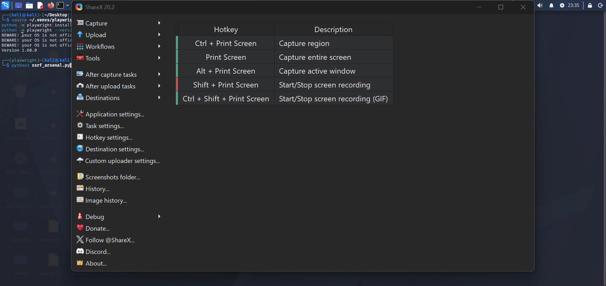

# Ultimate SSRF Framework v4.1

<div align="center">


### Advanced SSRF Discovery, Validation & Exploitation Framework

Automated Server-Side Request Forgery testing framework built for Bug Bounty Hunters, Penetration Testers, Red Team Operators and Security Researchers.

</div>

---

# 🚀 Highlights

* 50+ SSRF Discovery Paths
* 15 Attack Phases
* Blind SSRF Detection
* Multi-Cloud Metadata Testing
* WAF Fingerprinting
* Multi-LLM Support
* Proxy Rotation
* HTML Reporting
* Async Scanning Engine
* Bug Bounty Focused

---

# 📊 Project Status

✅ Active Development

**Current Version:** v4.1

### Implemented Features

* Multi-target scanning
* Blind SSRF detection
* WAF fingerprinting
* Multi-cloud metadata testing
* HTML reporting
* Multi-LLM integration
* AI payload generation
* AI triage
* Exploit chain suggestions
* Proxy support
* Proxy rotation
* Async scanning engine
* Docker support
* CI/CD integration

Ultimate SSRF Framework is designed to discover, validate and analyze Server-Side Request Forgery vulnerabilities across modern web applications and cloud environments.

---

# ⚡ Quick Start

```bash
git clone https://github.com/KauanCosta2000/Ultimate-ssrf-Framework.git

cd Ultimate-ssrf-Framework

pip install -r requirements.txt

playwright install chromium

python ssrf_arsenal.py --target example.com
```

## 📸 Demo

<div align="center">



</div>

### Example Scan

The framework automatically discovers SSRF candidates, performs validation, applies bypass techniques and generates structured reports for further analysis.

Supported outputs:

* Console Output
* JSON Reports
* HTML Reports


---

# 📖 Overview

Ultimate SSRF Framework provides automated discovery and validation capabilities for SSRF vulnerabilities while maintaining support for advanced bypass techniques, cloud metadata testing and out-of-band verification.

The framework combines traditional SSRF testing methodologies with modern automation and optional AI-assisted analysis.

---

# ✨ Core Features

## Discovery

* Dynamic endpoint discovery
* Parameter extraction
* Candidate identification
* Automatic crawling

## Validation

* Blind SSRF verification
* OAST callback support
* Response analysis
* Automatic confirmation

## Multi-Cloud Metadata Testing

Supported providers:

* AWS
* Azure
* Google Cloud
* Oracle Cloud
* DigitalOcean
* Alibaba Cloud
* Huawei Cloud
* Tencent Cloud

## Protocol Testing

Supported protocols:

* file://
* gopher://
* ftp://
* ldap://
* dict://
* tftp://

## Advanced Techniques

* DNS Rebinding
* Localhost bypasses
* CRLF injection
* XXE → SSRF
* URL parser confusion
* Redirect bypasses
* Encoding bypasses

---

# 🌐 Proxy Support

### HTTP Proxy

```bash
python ssrf_arsenal.py \
--target example.com \
--proxy http://127.0.0.1:8080
```

### SOCKS5 Proxy

```bash
python ssrf_arsenal.py \
--target example.com \
--proxy socks5://127.0.0.1:9050
```

### Proxy Rotation

```bash
python ssrf_arsenal.py \
--target example.com \
--proxy-file proxies.txt
```

---

# 🤖 AI Integration

Optional support for:

* GPT-4o
* Claude
* Gemini
* Ollama
* DeepSeek
* Mistral

Capabilities:

* Payload generation
* Finding triage
* Attack planning
* Exploit chain suggestions
* Report assistance

---

# ⚔️ Attack Phases

| Phase             | Description                                               |
| ----------------- | --------------------------------------------------------- |
| WAF Detection     | WAF and CDN fingerprinting                                |
| Discovery         | Endpoint and parameter discovery                          |
| Validation        | SSRF confirmation and verification                        |
| Parameter Fuzzing | Parameter mutation and testing                            |
| Localhost Bypass  | Internal network access techniques                        |
| Metadata Testing  | Cloud metadata endpoint testing                           |
| Internal Services | Redis, Docker, Vault, Kubelet and other internal services |
| Protocol Attacks  | file://, gopher://, ftp://, ldap://, dict:// and tftp://  |
| Redirect Bypass   | URL parser confusion and redirect abuse                   |
| DNS Rebinding     | Internal network targeting through DNS rebinding          |
| XXE → SSRF        | XML-based SSRF testing                                    |
| Encoding Bypass   | URL, Unicode and double encoding techniques               |
| CRLF Injection    | Header manipulation and request smuggling vectors         |
| Fragment Bypass   | URL fragment confusion techniques                         |
| Exotic Protocols  | Advanced protocol abuse scenarios                         |
| AI Payloads       | AI-assisted payload generation (optional)                 |
| AI Triage         | AI-assisted finding analysis (optional)                   |

---

# 📄 Reporting

Supported outputs:

* Console Output
* JSON Reports
* HTML Reports

---

# 🐳 Docker

Build image:

```bash
docker build -t ultimate-ssrf-framework .
```

Run scan:

```bash
docker run --rm ultimate-ssrf-framework --target example.com
```

See `Dockerfile` for the complete container configuration.

---

# 🔄 CI/CD Integration

Supported environments:

* GitHub Actions
* GitLab CI
* Jenkins
* Custom Pipelines

Example:

```yaml
name: SSRF Scan

on:
  workflow_dispatch:

jobs:
  scan:
    runs-on: ubuntu-latest

    steps:
      - uses: actions/checkout@v4

      - name: Install dependencies
        run: pip install -r requirements.txt

      - name: Run SSRF Framework
        run: python ssrf_arsenal.py --target-file targets.txt
```

---

# 🗺️ Roadmap

## Completed

* Async scanning engine
* Multi-cloud testing
* Blind SSRF detection
* AI integration
* Proxy rotation
* Docker support
* CI/CD support

## Upcoming

* WebSocket SSRF testing
* gRPC SSRF testing
* Interactive Dashboard
* Burp Suite Extension
* OWASP ZAP Plugin
* Kubernetes SSRF Module
* Serverless SSRF Testing
* Nuclei Template Export
* Slack Notifications
* Discord Notifications

---

# 🤝 Contributing

Contributions are welcome.

Please read:

* CONTRIBUTING.md
* SECURITY.md

before submitting pull requests.

---

# ⚠️ Disclaimer

This project is intended exclusively for authorized security testing, research and educational purposes.

The author assumes no responsibility for misuse or unauthorized activities performed using this software.

---

# 📜 License

MIT License

Copyright (c) 2025 Kauan Costa

---

# 👤 Author

**Kauan Costa (@belladonnask)**

GitHub:
https://github.com/KauanCosta2000

Repository:
https://github.com/KauanCosta2000/Ultimate-ssrf-Framework

---

<div align="center">

⭐ Star the repository if you find it useful.

Happy (authorized) hacking!

</div>
